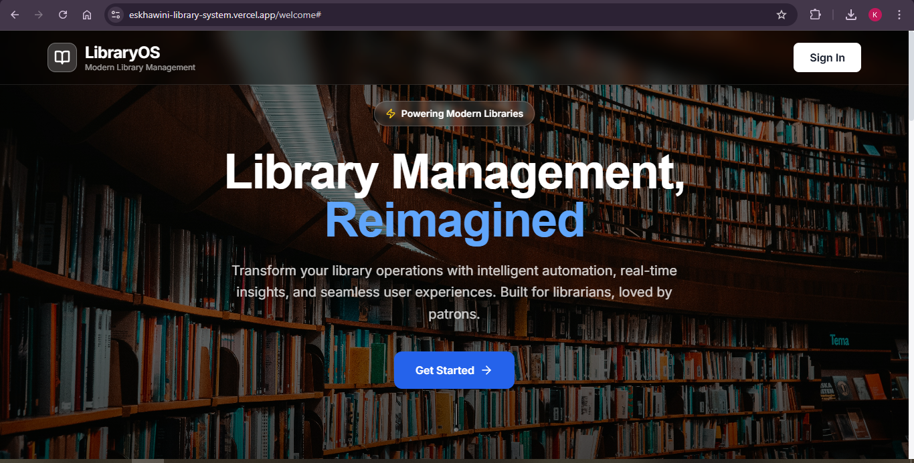
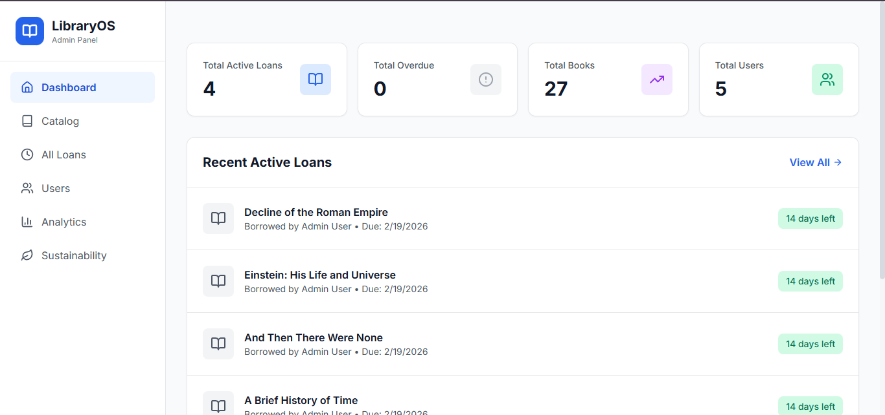
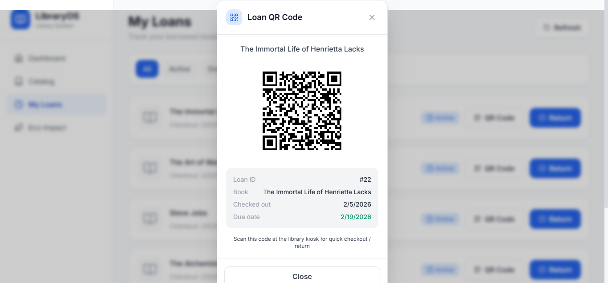
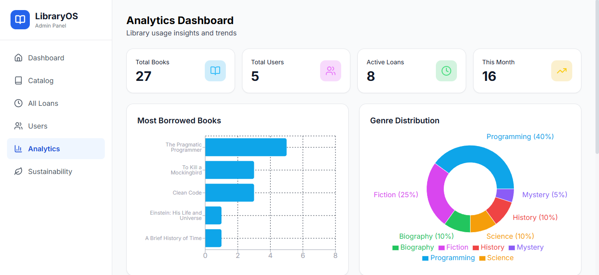
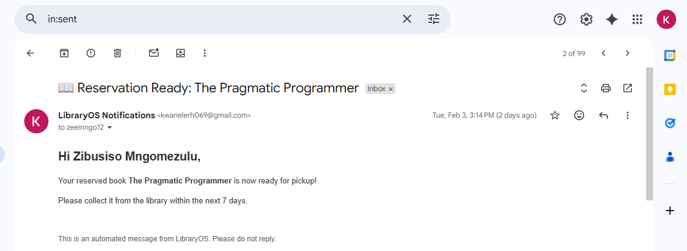
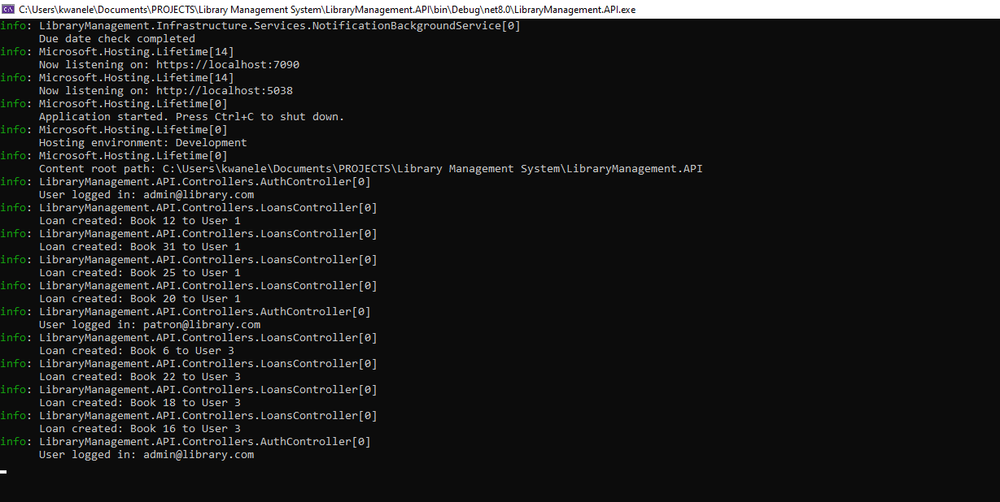

# Eskhawini LibraryOS

> A production-deployed, full-stack library management platform built on .NET 8 Clean Architecture and React 19. Covers the complete spectrum — from domain modelling and secure authentication to real-time notifications, cloud deployment, and CI/CD automation.

[](https://dotnet.microsoft.com/)
[](https://react.dev/)
[](https://www.postgresql.org/)
[](https://azure.microsoft.com/)
[](https://vercel.com/)
[](https://dotnet.microsoft.com/apps/aspnet/signalr)

**Live Demo:** [eskhawini-library-system.vercel.app](https://eskhawini-library-system.vercel.app)
**API Health:** [/health](https://library-management-api-enbrcma2b0e6f9dj.westus3-01.azurewebsites.net/health)

| Role | Email | Password |
|------|-------|----------|
| Admin | admin@library.com | Admin123! |
| Librarian | librarian@library.com | Lib123! |
| Patron | patron@library.com | Patron123! |

---

## Screenshots








---

## Overview

LibraryOS solves the operational challenges of a modern library — catalogue management, loan tracking, patron reservations, overdue notifications, and sustainability reporting — through a cohesive, role-aware platform.

The project is intentionally built to production standards: secrets never touch source control, the startup guard prevents misconfigured deployments from reaching production, all unhandled exceptions return structured JSON with correlation IDs, and the database schema is migrated automatically on every deploy.

**What makes this project technically interesting:**

- Real-time loan due reminders via SignalR with a background scheduler
- Token refresh race condition handled with a subscriber queue (not a naive retry loop)
- Password reset tokens persisted to the database, not in-memory, making them survive restarts and work across multiple instances
- CORS, allowed origins, and all secrets driven by environment variables — zero hardcoded configuration
- N+1 query eliminated at the repository interface level, not patched in the controller
- Cryptographically secure reset codes (`RandomNumberGenerator`) replacing `System.Random`

---

## Architecture

```
┌──────────────────────────────────────────────────────────────────┐
│                        React 19 SPA (Vercel)                     │
│   Axios + JWT Interceptors │ SignalR Client │ Recharts │ Vite    │
└───────────────────────────────┬──────────────────────────────────┘
                                │ HTTPS REST + WebSocket
┌───────────────────────────────┴──────────────────────────────────┐
│              ASP.NET Core 8 Web API (Azure App Service)          │
│  Controllers │ SignalR Hub │ GlobalExceptionMiddleware │ JWT     │
│  Rate Limiting │ Health Checks │ Swagger (dev only)             │
└───────────────────────────────┬──────────────────────────────────┘
                                │
┌───────────────────────────────┴──────────────────────────────────┐
│                     Core Layer (dependency-free)                  │
│         Entities │ DTOs │ Interfaces │ Enums                     │
└───────────────────────────────┬──────────────────────────────────┘
                                │
┌───────────────────────────────┴──────────────────────────────────┐
│                      Infrastructure Layer                         │
│  EF Core Repositories │ AuthService │ EmailService (SMTP)       │
│  QRCodeService │ PasswordResetService │ NotificationService      │
│  NotificationBackgroundService │ LibraryDbContext               │
└───────────────────────────────┬──────────────────────────────────┘
                                │
                    PostgreSQL 17 (Azure Flexible Server)
```

### Layer Responsibilities

| Layer | Project | Responsibility |
|-------|---------|---------------|
| Presentation | `LibraryManagement.API` | HTTP routing, middleware, SignalR hub, DI wiring |
| Domain | `LibraryManagement.Core` | Entities, interfaces, DTOs — no external dependencies |
| Infrastructure | `LibraryManagement.Infrastructure` | EF Core, repositories, email, QR, auth services |
| Frontend | `library-frontend` | React SPA consuming REST + WebSocket |

---

## Tech Stack

### Backend

| Technology | Version | Purpose |
|-----------|---------|---------|
| ASP.NET Core | 8.0 | Web API framework |
| Entity Framework Core | 8.0.0 | ORM and migrations |
| Npgsql EF Provider | 8.0.0 | PostgreSQL driver |
| BCrypt.Net-Next | 4.0.3 | Password hashing |
| System.IdentityModel.Tokens.Jwt | 8.0.0 | JWT generation and validation |
| Microsoft.AspNetCore.Authentication.JwtBearer | 8.0.0 | JWT middleware |
| AspNetCore.HealthChecks.NpgSql | 8.0.1 | PostgreSQL health probe |
| ZXing.Net | 0.16.9 | QR code generation (SVG) |
| Swashbuckle.AspNetCore | 6.5.0 | OpenAPI / Swagger UI |

### Frontend

| Technology | Version | Purpose |
|-----------|---------|---------|
| React | 19.2.0 | UI library |
| Vite | 7.2.4 | Build tool and dev server |
| React Router DOM | 7.13.0 | Client-side routing |
| Axios | 1.13.4 | HTTP client with interceptors |
| @microsoft/signalr | 10.0.0 | Real-time WebSocket client |
| Recharts | 3.7.0 | Analytics charts |
| Tailwind CSS | 3.4.19 | Utility-first styling |
| Lucide React | 0.563.0 | Icon set |

### Infrastructure

| Service | Provider | Purpose |
|---------|----------|---------|
| Backend hosting | Azure App Service (Windows, F1) | .NET 8 runtime |
| Database | Azure Database for PostgreSQL Flexible Server | Production data |
| Frontend hosting | Vercel | Global CDN, auto-deploy from GitHub |
| Email | Gmail SMTP + App Password | Transactional email |
| Container Registry | Azure Container Registry (`libraryosregistry`) | Image storage (reserved for future Docker deployment) |

---

## Features

### Authentication & Security
- JWT access tokens (HS256, 60-minute expiry) with rotating refresh tokens (7-day, one-time use)
- BCrypt password hashing (BCrypt.Net-Next v4)
- Token refresh race condition handled: a subscriber queue holds parallel 401 requests while one refresh executes, then replays them all — no duplicate refresh calls
- 6-digit password reset codes persisted to the database with a 15-minute expiry and `IsUsed` flag — survive restarts, safe for multi-instance deployments
- Codes generated with `System.Security.Cryptography.RandomNumberGenerator` (not `System.Random`)
- No user enumeration: identical response for existing and non-existing emails on reset request
- Rate limiting on `/api/auth/*`: 10 requests per minute, fixed window, returns HTTP 429
- CORS allowed origins read from configuration, not hardcoded

### Role-Based Access Control

Three roles with distinct permissions enforced at the controller level and reflected in the frontend UI:

| Capability | Patron | Librarian | Admin |
|-----------|--------|-----------|-------|
| Browse catalogue | Yes | Yes | Yes |
| Borrow / return books | Yes | Yes | Yes |
| Manage book records | No | Yes | Yes |
| View all loans | No | Yes | Yes |
| Access analytics | No | Yes | Yes |
| Manage users | No | No | Yes |
| Delete books | No | No | Yes |

### Book Catalogue
- Full-text search by title, author, ISBN, genre with server-side pagination
- Voice search via the Web Speech API with graceful fallback
- Inventory tracking (total copies vs. available copies)
- Cover images via Open Library API URL pattern
- 31 seed books across 6 genres included out of the box

### Loan Management
- Checkout with configurable due date calculation
- Return workflow with overdue detection
- Per-loan QR code (SVG, 200×200px) encoding: `LOAN:{id}|BOOK:{id}|USER:{id}|ISBN:{isbn}|DUE:{date}`
- Loan status lifecycle: Active → Returned / Overdue

### Reservations
- Book reservation with 7-day expiry
- Constraint: one pending reservation per user per book (enforced at DB level)
- Automatic promotion when a returned book matches a pending reservation

### Real-Time Notifications (SignalR)
- `LibraryHub` at `/hubs/library` — JWT auth via query string (required for WebSocket upgrade)
- Group-based routing: `userGroup:{userId}` for personal alerts, `bookGroup:{bookId}` for availability
- Events: `LoanDueSoon`, `ReservationReady`, `BookReturned`, `BookAvailable`
- `NotificationBackgroundService` runs daily, checks active loans for the 3-day due window using date-only comparison (not datetime, avoiding time-of-day drift)
- Frontend: auto-reconnect on disconnect, fresh JWT fetched on each reconnect, subscriber pattern for event listeners

### Analytics (Admin/Librarian)
- Summary: total books, registered users, active loans, monthly loan volume
- Most borrowed books ranking
- Genre popularity distribution
- User activity leaderboard
- All rendered with Recharts (bar, pie, line charts)

### Sustainability Tracking
- Carbon footprint calculation: `distance × weight × 0.00021 kg CO2/km/kg`
- Eco-impact summary: trees saved, paper saved, water consumption reduced
- Input collected at loan return (distance travelled, book weight)
- Patron-facing metrics to encourage library use over purchasing

### Email Notifications
- Password reset with 6-digit verification code
- Loan due soon reminder (3 days prior)
- Overdue notice
- Reservation ready for collection
- Book return confirmation
- All templates are HTML with inline CSS (no external stylesheet dependencies)

### Observability
- `GET /health` — overall status
- `GET /health/ready` — PostgreSQL liveness (tagged `db`, `ready`)
- `GET /health/live` — always 200, for Azure platform probes
- `GlobalExceptionMiddleware` catches all unhandled exceptions, logs with a correlation ID, returns structured `ProblemDetails` JSON — stack traces never reach the client

---

## API Reference

### Authentication (`/api/auth`) — rate limited

| Method | Endpoint | Auth | Description |
|--------|----------|------|-------------|
| POST | `/auth/register` | Public | Create account |
| POST | `/auth/login` | Public | Authenticate, receive JWT + refresh token |
| POST | `/auth/refresh` | Public | Rotate tokens using refresh token |
| POST | `/auth/request-password-reset` | Public | Email 6-digit reset code |
| POST | `/auth/reset-password` | Public | Verify code, set new password |

### Books (`/api/books`)

| Method | Endpoint | Auth | Description |
|--------|----------|------|-------------|
| GET | `/books?query&genre&status&page&pageSize` | Public | Paginated, searchable catalogue |
| GET | `/books/{id}` | Public | Single book detail |
| POST | `/books` | Librarian / Admin | Create book record |
| PUT | `/books/{id}` | Librarian / Admin | Update book record |
| DELETE | `/books/{id}` | Admin | Delete book |

### Loans (`/api/loans`)

| Method | Endpoint | Auth | Description |
|--------|----------|------|-------------|
| GET | `/loans` | Librarian / Admin | All system loans |
| GET | `/loans/my` | Authenticated | Current user's loans |
| GET | `/loans/{id}` | Authenticated | Single loan (role-scoped) |
| POST | `/loans` | Authenticated | Checkout a book |
| POST | `/loans/{id}/return` | Authenticated | Return with optional sustainability data |
| GET | `/loans/{id}/qrcode` | Authenticated | SVG QR code for loan |
| GET | `/loans/overdue` | Librarian / Admin | All overdue loans |

### Reservations (`/api/reservations`)

| Method | Endpoint | Auth | Description |
|--------|----------|------|-------------|
| GET | `/reservations` | Librarian / Admin | All reservations |
| GET | `/reservations/my` | Authenticated | User's reservations |
| POST | `/reservations` | Authenticated | Reserve a book |
| DELETE | `/reservations/{id}` | Authenticated | Cancel reservation |

### Analytics (`/api/analytics`) — Librarian / Admin

| Method | Endpoint | Description |
|--------|----------|-------------|
| GET | `/analytics/summary` | System-wide stats |
| GET | `/analytics/most-borrowed?count=10` | Top borrowed books |
| GET | `/analytics/user-activity?count=10` | Most active patrons |
| GET | `/analytics/genre-trends` | Genre popularity percentages |

### Sustainability (`/api/sustainability`)

| Method | Endpoint | Auth | Description |
|--------|----------|------|-------------|
| GET | `/sustainability/stats` | Authenticated | Carbon metrics |
| POST | `/sustainability/calculate` | Authenticated | Calculate footprint for distance + weight |
| GET | `/sustainability/eco-impact` | Authenticated | Trees / paper / water saved |

### Users (`/api/users`) — Admin only

| Method | Endpoint | Description |
|--------|----------|-------------|
| GET | `/users` | List all users |
| GET | `/users/{id}` | Single user |
| POST | `/users` | Create user |
| PUT | `/users/{id}` | Update user |
| DELETE | `/users/{id}` | Delete user |

---

## Database Schema

```
Users ──────────────── Loans ─────────────── SustainabilityMetrics
  │                      │                         (1:1 per loan)
  │                      └── Books
  │
  └── Reservations ───── Books

Users ── PasswordResetTokens
Books ── AnalyticsLogs (event log)
```

### Entities

| Entity | Key Fields |
|--------|-----------|
| `User` | Id, Name, Email (unique), PasswordHash, Role (enum), RefreshToken, RefreshTokenExpiry |
| `Book` | Id, Title, Author, ISBN (indexed), Genre, Status (enum), CoverUrl, TotalCopies, AvailableCopies |
| `Loan` | Id, UserId (FK), BookId (FK), CheckoutDate, DueDate, ReturnDate, QRCode (SVG base64), Status (enum) |
| `Reservation` | Id, UserId (FK), BookId (FK), ReservationDate, ExpiryDate, Status (enum) |
| `PasswordResetToken` | Id, UserId (FK), Code (6 digits), ExpiryTime, IsUsed, CreatedAt |
| `SustainabilityMetric` | Id, LoanId (FK 1:1), DistanceKm, WeightKg, CarbonFootprintKg |
| `AnalyticsLog` | Id, EventType, EntityId, UserId, Timestamp, Details |

### Migrations

| Migration | Description |
|-----------|-------------|
| `20260129_InitialCreate` | Base schema — Users, Books, Loans, Reservations, AnalyticsLogs |
| `20260203_AddBooks` | Seeds 31 books across 6 genres |
| `20260317_AddPasswordResetTokens` | Moves reset codes from in-memory to persistent storage |

Migrations run automatically on startup via `db.Database.Migrate()`. The app fails fast with a logged exception if migration fails — it will not start with a stale schema.

---

## Project Structure

```
LibraryManagement/
│
├── LibraryManagement.API/                  # Presentation layer
│   ├── Controllers/
│   │   ├── AuthController.cs               # Auth endpoints, [EnableRateLimiting("auth")]
│   │   ├── BooksController.cs
│   │   ├── LoansController.cs
│   │   ├── ReservationsController.cs
│   │   ├── AnalyticsController.cs
│   │   ├── SustainabilityController.cs
│   │   └── UsersController.cs
│   ├── Hubs/
│   │   └── LibraryHub.cs                   # SignalR — group management, event dispatch
│   ├── Middleware/
│   │   └── GlobalExceptionMiddleware.cs    # Correlation ID, structured ProblemDetails
│   ├── Properties/PublishProfiles/         # VS Publish profile (Azure Web Deploy)
│   ├── Program.cs                          # DI, pipeline, startup guard, health checks
│   ├── appsettings.json                    # Placeholder values only — no secrets
│   ├── appsettings.Production.json         # Logging config for Azure (no secrets)
│   └── appsettings.json.example            # Template for local developer setup
│
├── LibraryManagement.Core/                 # Domain layer — zero external dependencies
│   ├── Entities/
│   │   ├── User.cs
│   │   ├── Book.cs
│   │   ├── Loan.cs
│   │   ├── Reservation.cs
│   │   ├── PasswordResetToken.cs
│   │   ├── SustainabilityMetric.cs
│   │   └── AnalyticsLog.cs
│   ├── DTOs/
│   │   └── DTOs.cs                         # All request/response records with validation attributes
│   └── Interfaces/
│       └── IRepositories.cs                # 6 repository + 4 service interfaces
│
├── LibraryManagement.Infrastructure/       # Data access and external services
│   ├── Data/
│   │   └── LibraryDbContext.cs             # EF Core context, model config, seed data
│   ├── Migrations/                         # 3 EF Core migrations
│   ├── Repositories/
│   │   └── Repositories.cs                # All 6 repository implementations
│   └── Services/
│       ├── AuthService.cs                  # JWT generation, refresh token rotation
│       ├── PasswordResetService.cs         # DB-persisted reset codes, RandomNumberGenerator
│       ├── QRCodeService.cs                # ZXing SVG generation
│       ├── EmailService.cs                 # SMTP, 6 email templates
│       ├── NotificationService.cs          # SignalR dispatch + email orchestration
│       └── NotificationBackgroundService.cs # Daily due-date check
│
├── library-frontend/                       # React 19 SPA
│   ├── src/
│   │   ├── components/
│   │   │   ├── Auth/
│   │   │   │   ├── Login.jsx               # Demo credentials (VITE_DEMO_MODE gated)
│   │   │   │   └── ForgotPassword.jsx      # Multi-step reset wizard
│   │   │   ├── Dashboard/Dashboard.jsx     # Role-aware home screen
│   │   │   ├── Books/BookCatalog.jsx       # Search, voice search, CRUD modals
│   │   │   ├── Loans/LoansPage.jsx         # Checkout, return, QR viewer
│   │   │   ├── Analytics/AnalyticsPage.jsx # Recharts dashboard
│   │   │   ├── Sustainability/             # Carbon tracker
│   │   │   ├── Admin/UsersAdminPage.jsx    # User management (Admin only)
│   │   │   ├── Layout/Layout.jsx           # Sidebar, navigation
│   │   │   ├── LandingPage.jsx             # Public marketing page
│   │   │   └── ErrorBoundary.jsx           # React error boundary
│   │   ├── context/AuthContext.jsx         # Global auth state, SignalR init
│   │   ├── services/
│   │   │   ├── api.js                      # Axios + interceptors + refresh queue
│   │   │   └── signalr.js                  # SignalR singleton, auto-reconnect
│   │   ├── App.jsx                         # Routes, ProtectedRoute, AdminRoute
│   │   └── main.jsx                        # Entry point, ErrorBoundary wrapper
│   ├── .env.production                     # VITE_API_URL, VITE_HUB_URL, VITE_DEMO_MODE
│   └── Background-photo.jpg               # Landing page hero image
│
├── Dockerfile                              # Multi-stage .NET 8 build (reserved for future use)
├── .dockerignore
└── LibraryManagement.sln
```

---

## Getting Started (Local Development)

### Prerequisites

- [.NET 8 SDK](https://dotnet.microsoft.com/download/dotnet/8.0)
- [Node.js 18+](https://nodejs.org/)
- [PostgreSQL 16+](https://www.postgresql.org/) running locally
- [Git](https://git-scm.com/)

### 1. Clone

```bash
git clone https://github.com/dev-k99/Eskhawini-Library-System
cd Eskhawini-Library-System
```

### 2. Configure the backend

Copy the example config and fill in your local values:

```bash
cp LibraryManagement.API/appsettings.json.example LibraryManagement.API/appsettings.json
```

Edit `appsettings.json` — set your PostgreSQL password and a random JWT secret (any 32+ character string works locally).

### 3. Run the backend

```bash
cd LibraryManagement.API
dotnet restore
dotnet run
```

On first run, EF Core applies all migrations and seeds the database (3 users, 31 books) automatically.

- API base: `https://localhost:7090`
- Swagger UI: `https://localhost:7090/swagger`
- Health: `https://localhost:7090/health`

### 4. Run the frontend

```bash
cd library-frontend
npm install
echo "VITE_API_URL=https://localhost:7090/api" > .env
npm run dev
```

Frontend: `http://localhost:5173`

### 5. Demo credentials

| Role | Email | Password |
|------|-------|----------|
| Admin | admin@library.com | Admin123! |
| Librarian | librarian@library.com | Lib123! |
| Patron | patron@library.com | Patron123! |

---

## Deployment

### Backend — Azure App Service (Windows, F1)

Deployed via Visual Studio Publish (Web Deploy). All secrets are injected through Azure App Service → Configuration → Application Settings using the `__` double-underscore convention for nested keys:

| Setting | Example |
|---------|---------|
| `ASPNETCORE_ENVIRONMENT` | `Production` |
| `ConnectionStrings__DefaultConnection` | `Host=server.postgres.database.azure.com;...` |
| `JwtSettings__Secret` | 40+ character random string |
| `JwtSettings__Issuer` | `LibraryManagementAPI` |
| `JwtSettings__Audience` | `LibraryManagementClient` |
| `JwtSettings__ExpiryMinutes` | `60` |
| `Email__SmtpUser` | Gmail address |
| `Email__SmtpPassword` | Gmail App Password |
| `Cors__AllowedOrigins__0` | Vercel frontend URL |

The startup guard in `Program.cs` throws if `JwtSettings:Secret` is missing or placeholder in Production — ensuring a misconfigured deploy fails loudly at boot rather than silently serving broken responses.

### Database — Azure Database for PostgreSQL Flexible Server

Server: `library-db-server.postgres.database.azure.com`
Database: `librarydb`
EF Core migrations run automatically on startup.

### Frontend — Vercel

Connected to the `main` branch. Every push to `main` that touches `library-frontend/**` triggers an automatic Vercel rebuild. Environment variables (`VITE_API_URL`, `VITE_HUB_URL`, `VITE_DEMO_MODE`) are configured in the Vercel dashboard.

---

## Technical Deep Dives

### Token Refresh Race Condition

When multiple API calls return 401 simultaneously, a naive implementation would fire multiple refresh requests in parallel, causing all but the first to fail with an invalid token error. The fix uses a subscriber queue:

```js
// api.js — one refresh in flight at a time
let isRefreshing = false;
let refreshSubscribers = [];

function subscribeTokenRefresh(cb) {
  refreshSubscribers.push(cb);
}

function onTokenRefreshed(token) {
  refreshSubscribers.forEach(cb => cb(token));
  refreshSubscribers = [];
}

api.interceptors.response.use(null, async error => {
  if (error.response?.status === 401 && !originalRequest._retry) {
    if (isRefreshing) {
      return new Promise(resolve => {
        subscribeTokenRefresh(token => {
          originalRequest.headers.Authorization = `Bearer ${token}`;
          resolve(api(originalRequest));
        });
      });
    }
    isRefreshing = true;
    const newToken = await refreshAccessToken();
    onTokenRefreshed(newToken);
    isRefreshing = false;
  }
});
```

### N+1 Query Elimination

The original `GetAllReservations` fetched all users then queried loans per user in a loop — O(n) database round trips. Fixed by adding `GetAllAsync()` to `IReservationRepository` with eager loading:

```csharp
// ReservationRepository
public async Task<List<Reservation>> GetAllAsync() =>
    await _context.Reservations
        .Include(r => r.User)
        .Include(r => r.Book)
        .ToListAsync();
```

The controller now makes one query regardless of dataset size.

### Database-Persisted Password Reset

The original implementation stored reset codes in a `ConcurrentDictionary<string, ResetCodeData>` — lost on restart, not safe for multi-instance deployments. Replaced with a `PasswordResetToken` entity persisted to PostgreSQL with:
- A composite index on `(UserId, IsUsed)` for fast lookups
- `IsUsed` flag set atomically on successful reset
- Old pending codes invalidated on every new request
- `RandomNumberGenerator.Fill()` instead of `new Random().Next()`

### Global Exception Middleware

```csharp
public class GlobalExceptionMiddleware
{
    public async Task InvokeAsync(HttpContext context)
    {
        try { await _next(context); }
        catch (Exception ex)
        {
            var correlationId = Guid.NewGuid().ToString()[..8];
            _logger.LogError(ex, "Unhandled exception. CorrelationId: {Id}", correlationId);

            var status = ex switch {
                UnauthorizedAccessException => 401,
                InvalidOperationException   => 400,
                _                           => 500
            };

            context.Response.ContentType = "application/problem+json";
            context.Response.StatusCode = status;
            await context.Response.WriteAsJsonAsync(new {
                title = "An error occurred",
                status,
                correlationId
                // detail only included in Development
            });
        }
    }
}
```

No stack trace ever reaches the client in production. The correlation ID links the client-visible error to the server log entry.

---

## Security Checklist

| Control | Status |
|---------|--------|
| Secrets in environment variables only | Implemented |
| BCrypt password hashing | Implemented |
| JWT with short expiry + refresh rotation | Implemented |
| Refresh token stored in database | Implemented |
| Rate limiting on auth endpoints | Implemented (10 req/min) |
| CORS configured from environment | Implemented |
| Role-based access control | Implemented (3 roles) |
| SQL injection prevention via EF Core | Implemented |
| No user enumeration on password reset | Implemented |
| Cryptographically secure reset codes | Implemented (RandomNumberGenerator) |
| Reset tokens expire and invalidate | Implemented (15 min, IsUsed flag) |
| Global exception handler — no stack trace leaks | Implemented |
| Startup guard prevents misconfigured boot | Implemented (Production only) |
| Health check endpoints (no auth) | Implemented |
| Automated tests | Planned |
| Refresh token revocation on logout | Planned |

---

## Roadmap

### Near-term
- Unit tests: xUnit for service layer, Jest + React Testing Library for components
- Integration tests with `TestContainers` (real PostgreSQL in CI)
- Server-side refresh token revocation on logout
- Structured logging with Serilog (file + database sink)

### Medium-term
- Fine calculation for overdue loans
- Book review and rating system
- PDF export for borrowing history
- Advanced search filters (publication year, language, availability)
- Dark mode

### Long-term
- React Native app for QR scanning at physical kiosks
- ML.NET personalised book recommendations
- Microservices split (Auth, Catalogue, Loans, Notifications)
- Elasticsearch for full-text search at scale

---

## Contributing

1. Fork the repository
2. Create a feature branch: `git checkout -b feature/your-feature`
3. Copy `appsettings.json.example` → `appsettings.json` and configure locally
4. Make your changes — keep each commit focused
5. Push and open a pull request against `main`

Please open an issue before starting significant work so we can discuss approach.

---

## Author

**Kwanele Ntshangase**

- LinkedIn: [kwanele-ntshangase](https://www.linkedin.com/in/kwanele-ntshangase-abab7037b/)
- Portfolio: [dev-k99.github.io/Portfolio](https://dev-k99.github.io/Portfolio/)
- Email: kwanelerh069@gmail.com

---

## Acknowledgements

- [Clean Architecture](https://blog.cleancoder.com/uncle-bob/2012/08/13/the-clean-architecture.html) — Robert C. Martin
- [Open Library](https://openlibrary.org/developers/api) — book cover images
- [ZXing](https://github.com/zxing/zxing) — QR code generation
- [Microsoft SignalR](https://dotnet.microsoft.com/apps/aspnet/signalr) — real-time transport
- [Tailwind CSS](https://tailwindcss.com) — utility-first styling

---

<div align="center">

Built and deployed end-to-end as a demonstration of full-stack .NET and React engineering.

If this project was useful or interesting, a star is appreciated.

</div>
